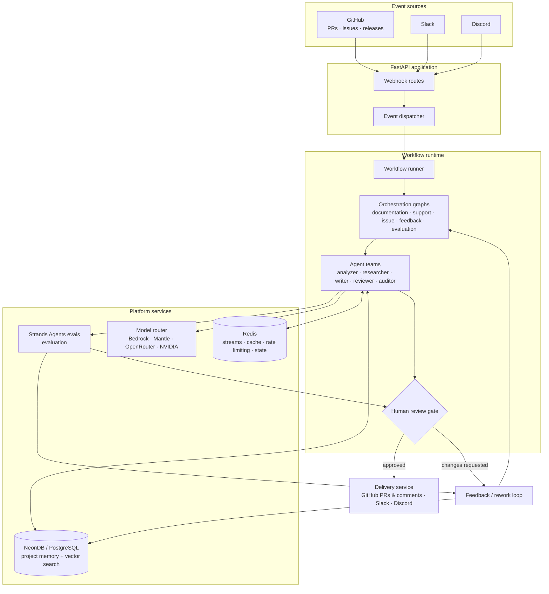

# Draftly

**Autonomous documentation engineering platform.**

Draftly is an event-driven, multi-agent documentation engineering platform that continuously keeps software documentation aligned with a changing codebase and the people using it.

Draftly watches signals from GitHub, Slack, and Discord, understands what changed, researches the project's existing knowledge, generates documentation or support responses, evaluates the result, routes it through human review when required, and delivers approved changes. Feedback from evaluations, reviewers, and users feeds back into project memory and future workflows.

> **Draftly turns documentation from a manually maintained artifact into a continuous engineering process.**

---

## Why Draftly?

Software changes faster than documentation.

A pull request can introduce a new API, change authentication behavior, deprecate a feature, or alter an SDK without anyone remembering to update the relevant documentation. Meanwhile, users ask questions in Slack, Discord, and GitHub issues that reveal gaps in the existing docs.

Traditional documentation workflows usually depend on someone noticing these changes and manually connecting them to the right documentation. Draftly automates that loop.

| Traditional documentation   | Draftly                                             |
| --------------------------- | --------------------------------------------------- |
| Manually maintained         | Event-driven                                        |
| Updated after the fact      | Continuously monitored                              |
| Author searches for context | Agents research project context                     |
| One-off generation          | Workflow-based documentation engineering            |
| Static knowledge            | Persistent, curated project memory                  |
| Quality checked manually    | Evaluated against evidence                          |
| Human does the entire task  | Agents perform the work, humans control publication |
| Feedback is often lost      | Feedback becomes a signal for future improvements   |

---

## The Documentation Engineering Loop

Draftly is built around a continuous documentation engineering loop:

```text
┌──────────────────────┐
│   Software Project   │
│ GitHub · Slack ·     │
│ Discord · Docs       │
└──────────┬───────────┘
           │
           ▼
        OBSERVE
           │
           ▼
       UNDERSTAND
           │
           ▼
         RESEARCH
           │
           ▼
        GENERATE
           │
           ▼
        EVALUATE
           │
           ▼
      HUMAN REVIEW
         /       \
    changes      approve
     requested      │
        │           ▼
        └──────►  DELIVER
                   │
                   ▼
                FEEDBACK
                   │
                   ▼
          CURATE PROJECT MEMORY
                   │
                   ▼
            FUTURE WORKFLOWS
```

Draftly does not stop after generating documentation. Every workflow produces useful signals — evaluation failures, reviewer corrections, recurring support questions, documentation gaps, rejected changes, grounding failures, and successful outcomes — and those signals improve project memory, prioritization, skills, prompts, retrieval, and model routing.

---

## What Draftly Does

- **GitHub change analysis** — analyzes pull requests, issues, and releases to determine what changed and whether it has documentation impact.
- **Documentation generation & sync** — researches the repository and project knowledge before generating conceptual docs, how-tos, tutorials, API references, release documentation, and updates, delivered as GitHub pull requests for review.
- **Developer support** — responds to questions from GitHub issues, Slack, and Discord, grounded in indexed project documentation and project knowledge.
- **Feedback loop** — turns support questions, reviewer feedback, and evaluation failures into future documentation work and documented gap analysis.
- **Human-in-the-loop review** — configurable review policies hold agent output at a review gate until a human approves it.
- **Persistent project memory** — searchable, curated project knowledge that agents retrieve for grounding, deduplication, and future workflows.
- **Evaluation** — scores agent outputs on groundedness, correctness, completeness, relevance, documentation quality, and review behavior.
- **Multi-provider model routing** — pluggable registry and router across Amazon Bedrock, Bedrock Mantle, OpenRouter, NVIDIA, Requesty, and Orcarouter.

---

## How Draftly Works

A typical documentation workflow looks like this:

```text
GitHub PR
   │
   ▼
Webhook
   │
   ▼
Event normalization
   │
   ▼
Workflow selection
   │
   ▼
Documentation impact analysis
   │
   ▼
Repository + project research
   │
   ▼
Documentation generation
   │
   ▼
Evaluation
   │
   ▼
Human review
   │
   ├─────────────── changes requested ──────┐
   │                                        │
   ▼                                        │
Delivery                                    │
   │                                        │
   ▼                                        │
GitHub PR / Slack / Discord                 │
                                            │
                                            └──► Rework → Evaluation
```

The exact workflow depends on the event and the configured workflow policy.

### Core concepts

- **Events** — normalized signals representing changes or interactions from GitHub, Slack, and Discord.
- **Workflows** — the business process Draftly executes for an event (documentation sync, GitHub issue handling, support, release authoring, feedback processing, evaluation).
- **Agents** — specialized reasoning units within workflows (change analyzers, repository researchers, documentation writers, support agents, reviewers, auditors, memory curators).
- **Skills** — self-contained, reusable agent capabilities: instructions, rules, resources, templates, examples, and domain-specific guidance.
- **Memory** — durable, curated project knowledge that agents retrieve during future workflows.
- **Evaluation** — determines whether agent behavior and outputs meet workflow quality requirements.
- **Review gates** — explicit human control over agent-generated changes.
- **Delivery** — publishes approved results back to project communication and development systems.

> **Workflows decide what happens. Agents perform reasoning. Skills define reusable capabilities.**

---

## Architecture



1. **Event sources** produce project or user events.
2. **Webhook routes** receive and authenticate incoming events.
3. **Event dispatcher** normalizes them into Draftly events.
4. **Workflow runner** selects and starts the appropriate workflow.
5. **Orchestration graphs** coordinate specialized agents.
6. **Agents** research, reason, write, review, and curate project knowledge.
7. **Memory** provides persistent project context and retrieval.
8. **Model routing** selects an appropriate model for each task.
9. **Evaluation** scores generated outputs.
10. **Human review** controls publication when required.
11. **Delivery** publishes approved results.
12. **Feedback** becomes input to rework, memory curation, prioritization, and future workflows.

The evaluation and feedback systems are not isolated from the runtime; they form a learning loop around agent execution:

```text
Execute
  ↓
Evaluate
  ↓
Observe failure or success
  ↓
Understand the cause
  ↓
Improve context / skills / prompts / routing
  ↓
Execute again
  ↓
Compare results
```

---

## Example: Pull Request → Documentation

Suppose a pull request changes authentication behavior:

```text
PR changes authentication
        ↓
GitHub webhook
        ↓
Event normalization
        ↓
Documentation workflow
        ↓
Impact analysis
        ↓
Find affected documentation
        ↓
Research repository + existing docs
        ↓
Generate documentation update
        ↓
Evaluation
        ↓
Human review
        ↓
Approved
        ↓
Documentation PR
```

If the reviewer requests changes:

```text
Reviewer feedback
        ↓
Rework
        ↓
Re-evaluation
        ↓
Human review
        ↓
Approval
```

Draftly also bootstraps its project knowledge from an existing repository: connecting a GitHub repository, indexing its existing documentation, analyzing the codebase, building initial project knowledge, identifying documentation gaps, and generating an initial documentation PR. It does not require a project to start with a perfect documentation system.

---

## Evaluation

Draftly uses **Strands Agents evals** to evaluate agent behavior and generated outputs. Evaluation proceeds through the same workflow surfaces as production events:

```text
Dataset
   ↓
Draftly workflow
   ↓
Agent execution
   ↓
Strands Agents evals
   ↓
Evaluation results
   ↓
Failure analysis
```

### Evaluation dimensions

| Metric                  | Description                                               |
| ----------------------- | --------------------------------------------------------- |
| `groundedness`          | Claims are traceable to available evidence                |
| `correctness`           | Output is factually accurate                              |
| `completeness`          | Essential information is covered                          |
| `relevance`             | Output directly addresses the task                        |
| `documentation_quality` | Citation coverage, topic coverage, and adequate detail    |
| `expected_interrupt`    | Workflow correctly stops at the configured review gate    |
| `expected_passthrough`  | Workflow correctly passes through when review is disabled |

### Running evaluations

Datasets live under [`src/draftly/evaluation/datasets/`](src/draftly/evaluation/datasets/):

```bash
# Documentation (PR event) evaluation
uv run python scripts/run_evaluation.py --live --datasets src/draftly/evaluation/datasets/documentation.json

# GitHub issue evaluation
uv run python scripts/run_evaluation.py --live --datasets src/draftly/evaluation/datasets/github_issues.json

# Support question evaluation
uv run python scripts/run_evaluation.py --live --datasets src/draftly/evaluation/datasets/slack.json

# Discord support evaluation (same support graph, Discord event source)
uv run python scripts/run_evaluation.py --live --datasets src/draftly/evaluation/datasets/discord.json

# Feedback loop evaluation (gap detection and prioritization)
uv run python scripts/run_evaluation.py --live --datasets src/draftly/evaluation/datasets/feedback.json

# Release authoring evaluation (includes review gate checks)
uv run python scripts/run_evaluation.py --live --datasets src/draftly/evaluation/datasets/release.json
```

> [!NOTE]
> Live runs invoke real agent graphs and LLM judges. Each dataset runs with a ~600s inner budget. Use `--datasets` with a single-case file for smoke runs to stay within timeouts.

### Evaluation as a build loop

Evaluation is also the agent-development loop:

```text
Change agent / skill / workflow
        ↓
Run evaluation
        ↓
Inspect failures and traces
        ↓
Identify failure cause
        ↓
Improve implementation
        ↓
Run evaluation again
        ↓
Compare results
```

The objective is not to prove that an agent works once, but to continuously improve agent behavior against representative scenarios.

---

## Adaptive Model Routing

Draftly supports multiple model providers through a pluggable model registry and routing layer. The router selects models based on task requirements such as reasoning needs, context requirements, latency, cost, provider availability, and historical evaluation performance:

```text
Task
  ↓
Candidate models
  ├── capability
  ├── cost
  ├── latency
  ├── context requirements
  └── historical performance
  ↓
Selected model → Agent execution → Evaluation → Routing feedback
```

---

## Integrations

- **GitHub** — analyzes pull requests, processes issues, analyzes releases, identifies documentation impact, creates documentation PRs, and responds to issues and comments.
- **Slack** — consumes support and engineering signals and provides grounded responses.
- **Discord** — consumes developer and community questions and responds using project documentation and persistent knowledge.
- **Clerk** — application authentication through JWT-based authentication.

---

## Tech Stack

| Layer           | Technology                                                 |
| --------------- | ---------------------------------------------------------- |
| Language        | Python 3.11, managed with [uv](https://docs.astral.sh/uv/) |
| API             | FastAPI + Uvicorn                                          |
| Agents          | [Strands Agents](https://github.com/strands-agents) SDK    |
| Evaluation      | Strands Agents evals                                       |
| Database        | PostgreSQL (asyncpg / psycopg), NeonDB-compatible          |
| Vector search   | Redis, pgvector, or dual backend                           |
| Event streaming | Redis streams / pubsub                                     |
| Cache           | Redis (semantic cache, rate limiting, distributed state)   |
| Background jobs | RQ workers                                                 |
| Auth            | Clerk (JWT), plus Slack, Discord, and GitHub app auth      |
| Observability   | structlog, tracing, metrics, audit logging                 |

---

## Getting Started

### Prerequisites

- Python 3.11+
- [uv](https://docs.astral.sh/uv/getting-started/installation/)
- A PostgreSQL database (NeonDB works) and Redis
- AWS credentials with access to Amazon Bedrock (or an IAM role)

### Install

```bash
uv sync
```

### Configure

```bash
cp .env.example .env
```

At minimum, configure your database and AWS access:

```text
DATABASE_URL=...
AWS_REGION=...
```

> [!TIP]
> Only `DATABASE_URL` and AWS access are required. All other model providers (NVIDIA, OpenRouter, Requesty, Orcarouter, Mantle) are optional fallbacks for the model router.

### Run the API

```bash
python main.py
```

The FastAPI application starts on the configured host and port. Interactive API documentation is available at:

```text
http://localhost:8000/docs
```

### Redis & worker containers (Docker)

Draftly depends on Redis for event streaming, RQ job queues, caching, and rate limiting, and on worker processes to consume those queues asynchronously. A ready-to-run [compose file](docker-compose.redis.yml) defines a Redis container plus an RQ worker container.

**Start only Redis** (for local development, when the API and workers run natively via `python main.py`):

```bash
docker compose -f docker-compose.redis.yml up -d redis
```

**Start Redis + the RQ worker together** (queue-backed execution without an in-process runner):

```bash
docker compose -f docker-compose.redis.yml up -d
```

The compose file wires `REDIS_URL=redis://redis:6379/0` into the worker and sets `depends_on: redis: condition: service_healthy`, so the worker only starts once Redis reports healthy.

**Standalone worker container** (from `docker/Dockerfile.worker`):

```bash
docker build -f docker/Dockerfile.worker -t draftly-worker .
docker run --rm \
  -e REDIS_URL=redis://host.docker.internal:6379/0 \
  -e DATABASE_URL="$DATABASE_URL" \
  draftly-worker
```

**Fully containerized API** (from `docker/Dockerfile.api`):

```bash
docker build -f docker/Dockerfile.api -t draftly-api .
docker run --rm \
  -p 8000:8000 \
  -e "REDIS_URL=redis://host.docker.internal:6379/0" \
  draftly-api
```

> [!NOTE]
>
> - The `rq-worker` container reads `.env` via `env_file` and expects the GitHub private key referenced by `GITHUB_PRIVATE_KEY_PATH` to be available at `secrets/private-key.pem`. Ensure those exist before starting the worker.
> - When Redis runs on the host and the worker runs in Docker on macOS or Windows, use `host.docker.internal` rather than `localhost` for `REDIS_URL`.

---

## Background Workers

Draftly separates long-running work from the API process through dedicated workers.

| Worker            | Purpose                                                     | Command                             | Docker container      |
| ----------------- | ----------------------------------------------------------- | ----------------------------------- | --------------------- |
| `rq_worker`       | Consumes the RQ queues (`scheduled`, `webhooks`, `default`) | `python -m workers.rq_worker`       | `rq-worker` (compose) |
| `event_worker`    | Serves the API; in-process event processing                 | `python -m workers.event_worker`    | —                     |
| `workflow_worker` | Periodic jobs: workflow retries and review expiry           | `python -m workers.workflow_worker` | —                     |

Environment-specific defaults live in `config/` (`development.yaml`, `staging.yaml`, `production.yaml`).

---

## Configuration

See [`.env.example`](.env.example) for the complete configuration.

### Required

| Variable        | Description                                |
| --------------- | ------------------------------------------ |
| `DATABASE_URL`  | PostgreSQL / NeonDB connection string      |
| `AWS_REGION`    | Region for Amazon Bedrock                  |
| AWS credentials | Credentials or IAM role for Bedrock access |

### Infrastructure

| Variable                 | Description                                                   |
| ------------------------ | ------------------------------------------------------------- |
| `REDIS_URL`              | Redis connection string (default: `redis://localhost:6379/0`) |
| `SEMANTIC_CACHE_ENABLED` | Enable LLM semantic cache (default: `True`)                   |
| `VECTOR_SEARCH_BACKEND`  | `redis`, `pgvector`, or `dual` (default: `dual`)              |
| `EVENT_BUS_BACKEND`      | `pubsub`, `stream`, or `dual` (default: `dual`)               |

### Models

| Variable                         | Description                        |
| -------------------------------- | ---------------------------------- |
| `BEDROCK_CLAUDE_REASONING_MODEL` | Reasoning model override           |
| `BEDROCK_CLAUDE_FAST_MODEL`      | Fast model override                |
| `EMBEDDING_MODEL_ID`             | Embedding model used for retrieval |

### Optional providers

```text
MANTLE_API_KEY, MANTLE_ENDPOINT_URL
OPENROUTER_API_KEY
NVIDIA_API_KEY
REQUESTY_API_KEY
ORCAROUTER_API_KEY
```

---

## Development

### Code quality

```bash
uv run ruff check .
uv run ruff format --check .
uv run mypy src
```

### Tests

```bash
uv run pytest                  # unit + workflow tests
uv run pytest -m integration   # live integration tests
```

> [!IMPORTANT]
> Integration tests may use a live database and real model endpoints. Set `DRAFTLY_LIVE=1` and provide valid credentials before running them.

---

## Project Structure

```text
draftly-agent-backend/
├── src/draftly/
│   ├── agents/          # Agent definitions and prompts
│   ├── evaluation/      # Evaluation framework and datasets
│   ├── integrations/    # Slack, Discord, GitHub, database
│   ├── models/          # Model router and providers
│   ├── orchestration/   # Graphs, nodes, and routing
│   ├── skills/          # Self-contained agent capabilities
│   └── workflows/       # Workflow definitions
├── scripts/             # CLI and evaluation utilities
├── workers/             # Background worker processes
├── config/              # Environment-specific configuration
└── docs/                # Architecture and engineering documentation
```

### Where the pieces fit

```text
Event → Integration → Orchestration → Workflow → Agents
  → Skills + Tools + Memory → Model Router → Evaluation
  → Review → Delivery
```

---

## Documentation

Detailed engineering documentation lives in [`docs/`](docs), covering:

- **Architecture** — overview & design, event-driven design, multi-agent topology, orchestration, memory, feedback loops, documentation pipeline, persistence, integrations, security, delivery, evaluation, review, observability, support, tools, Redis, and the models router (`docs/architecture/`)
- **Agents** — agent overview, research swarms, and packaged skills (`docs/agents/`)
- **API** — route reference and GitHub, Slack, Discord, and Clerk webhook handling (`docs/api/`)
- **Workflows** — workflow overview plus documentation sync, GitHub PR and issue, support, and feedback loop guides (`docs/workflows/`)
- **Deployment** — AWS, production configuration, CockroachDB, and Redis operations (`docs/deployment/`)
