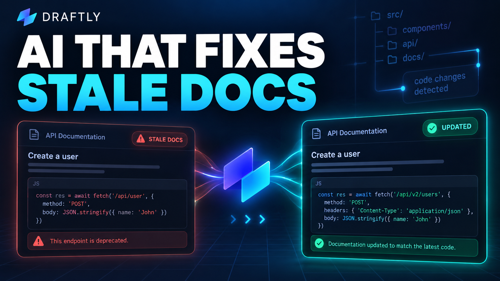
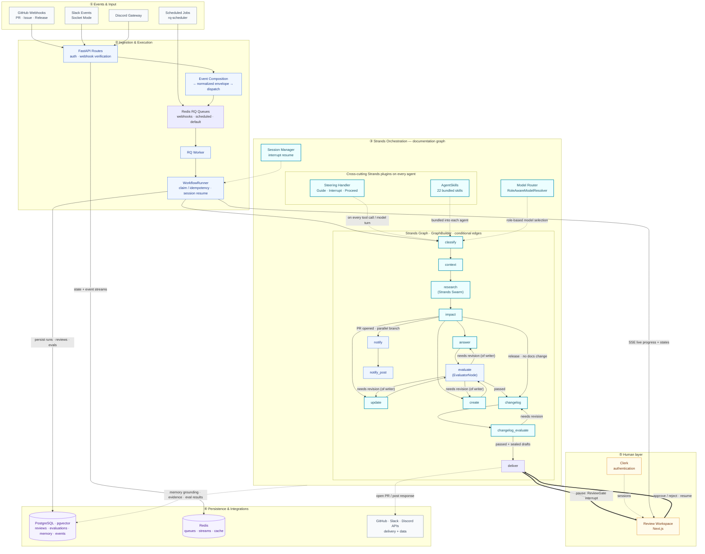

<!-- prettier-ignore -->
<div align="center">

# Draftly

**Documentation that keeps up with your code.**

[](LICENSE)
[](https://www.python.org/)
[](https://github.com/strands-agents/sdk-python)
[](https://agentsforhumans.devpost.com/)

[Run locally](#run-draftly) · [Walkthrough](#from-code-change-to-reviewed-documentation) · [Architecture](#architecture) · [Frontend](../draftly-agent-ui/README.md)

</div>

Draftly helps SDK maintainers and developer teams keep documentation aligned with their code. It watches GitHub changes and developer questions, researches the project, and prepares documentation updates for review — so maintainers can focus on decisions instead of repeatedly investigating and rewriting docs.

Built with **Strands Agents SDK**, a Python/FastAPI backend, and a Next.js review workspace. This directory contains the backend; the [frontend](../draftly-agent-ui/README.md) provides onboarding, workflow inspection, and human review.

<div align="center">
  <a href="https://youtu.be/o-_z05If_-Y">
    
  </a>
</div>

## Architecture



For deeper implementation detail, see [orchestration](docs/architecture/orchestration.md), [model routing](docs/architecture/models-router.md), [memory](docs/architecture/memory.md), and [delivery](docs/architecture/delivery.md).

## Features

- **Event-triggered documentation maintenance** — starts from merged PRs and release events
- **Grounded developer support** — answers GitHub, Slack, and Discord questions with project context
- **Research with evidence** — connects proposed answers and updates to repository and documentation sources
- **Configurable human review** — `always`, `risky`, or `never` review policies gate delivery
- **Feedback and project memory** — curates knowledge candidates and provides curation and retrieval workflows
- **Agent observability** — inspect agent catalog, runs, and steps via authenticated API

## Run Draftly

### Prerequisites

> [!IMPORTANT]
> You need Python 3.11+, `uv`, Docker for Redis, and a PostgreSQL database with the `vector` extension. Node.js and Clerk configuration are required for the frontend experience.

### 1. Install

From the workspace containing both app directories:

```bash
cd draftly-agent-backend
uv sync --extra dev
cp .env.example .env
```

The `dev` extra installs the linting, type-checking, and test tools used later in this guide. For a runtime-only environment, use `uv sync` instead.

Configure `.env` using the table below. The example file does not list every integration setting; [Settings](src/draftly/app/config.py) is the source for those names.

| Setting                                                           | Required for                                                                                            |
| ----------------------------------------------------------------- | ------------------------------------------------------------------------------------------------------- |
| `DATABASE_URL`                                                    | Database connectivity and migrations; use a dedicated development database                              |
| `AWS_REGION` plus AWS credentials or an IAM role                  | The Bedrock model path; alternatively configure a supported model provider                              |
| `REQUESTY_API_KEY`, `ORCAROUTER_API_KEY`, or `OPENROUTER_API_KEY` | At least one embedding provider for semantic retrieval; Bedrock embeddings are not implemented directly |
| `EMBEDDING_MODEL_ID=text-embedding-3-small`                       | The configured embedding provider must serve the model and return 1,536-dimensional vectors             |
| `REDIS_URL=redis://localhost:6379/0`                              | Queue consumption, state, and event streaming                                                           |
| `DEBUG=false`                                                     | Boolean debug setting; an exported shell value overrides `.env`                                         |
| `RQ_ENABLED=true`                                                 | The recommended separate-worker execution path                                                          |
| `VECTOR_SEARCH_BACKEND=pgvector`                                  | Vector search for this setup, because Compose uses plain Redis                                          |
| `SEMANTIC_CACHE_ENABLED=false`                                    | Avoids requiring RediSearch for the semantic cache in this setup                                        |

> [!TIP]
> If your shell exports a non-boolean `DEBUG` value, run `export DEBUG=false` before starting the commands below.

### 2. Initialize the database and start Redis

```bash
uv run python scripts/bootstrap.py
docker compose -f docker-compose.redis.yml up -d redis
docker compose -f docker-compose.redis.yml exec redis redis-cli ping
```

The Redis check should return `PONG`. The bootstrap script applies SQL migrations in filename order and checks connectivity. It handles some duplicate-object errors by skipping; it is not a version-tracking migration system.

Start the worker container (builds `docker/Dockerfile.worker` and runs `workers.rq_worker` inside Docker):

```bash
docker compose -f docker-compose.redis.yml up -d --build rq-worker
docker compose -f docker-compose.redis.yml up -d --force-recreate rq-worker
docker compose -f docker-compose.redis.yml logs -f rq-worker
```

`up -d --build` builds and starts the worker; `--force-recreate` forces a fresh container when you need to pick up changes; `logs -f rq-worker` follows the worker's output. If you run the worker in Docker, skip the native `uv run python -m workers.rq_worker` command in step 3 — use one worker, not both.

### 3. Start both native processes

In one terminal:

```bash
uv run python -m workers.rq_worker
```

In a second terminal:

```bash
uv run python main.py
```

Both processes load the same `.env`. The RQ worker consumes the `scheduled`, `webhooks`, and `default` queues under the configured prefix. Starting only the API does not consume queued jobs. If you already started the worker container in step 2, run only `uv run python main.py` here.

### 4. Check liveness and readiness

```bash
curl --fail http://localhost:8000/api/health
curl --fail http://localhost:8000/api/health/ready
```

The liveness response is `{"status":"ok","service":"draftly"}`. Readiness returns HTTP 200 only when the database, memory, and evaluation dependencies are available. Explore the API at [localhost:8000/docs](http://localhost:8000/docs).

### 5. Connect the review workspace

Follow the [frontend setup guide](../draftly-agent-ui/README.md), using `API_URL=http://localhost:8000`. Configure `CLERK_PUBLISHABLE_KEY` and `CLERK_SECRET_KEY` on the backend for the same Clerk application used by the frontend.

For the GitHub workflow, configure `GITHUB_APP_ID`, `GITHUB_APP_SLUG`, `GITHUB_PRIVATE_KEY_PATH`, and `GITHUB_WEBHOOK_SECRET`. Install the GitHub App on the target repository and configure its webhook against your backend. See [webhooks](docs/api/webhooks.md) and [GitHub workflow behavior](docs/workflows/github-pr.md).

> [!NOTE]
> Slack and Discord credentials are needed only when connecting those integrations. See [integration architecture](docs/architecture/integrations.md).

## From code change to reviewed documentation

**Illustrative walkthrough: adding OAuth authentication to Authly.** Authly is a fictional benchmark application used to exercise documentation drift. This example follows the checked-in `oauth-authentication-add` evaluation case.

1. **A change arrives.** The case represents a merged PR adding OAuth authorization URLs, authorization-code exchange, and OAuth-backed login. The production GitHub route skips PR events that are not merged.
2. **Draftly researches the impact.** Agents inspect the repository and documentation, including the OAuth implementation, authentication flow, and client configuration.
3. **A documentation update is proposed.** The expected update explains provider setup, URL construction, callback handling, code exchange, and login. Writers produce a structured file-change plan; delivery tools are excluded from their tool set.
4. **The output is checked.** The documentation graph evaluates the output and can route it back for revision. It also authors and checks a changelog before reaching delivery.
5. **A maintainer decides.** With `review_policy: always`, the graph pauses before delivery. The reviewer can approve or reject; a rejection cancels delivery.
6. **Delivery follows approval.** The delivery agent has tools to create the documentation PR.

| Before                                     | Expected documentation coverage                           |
| ------------------------------------------ | --------------------------------------------------------- |
| OAuth behavior introduced without guidance | Authorization URL construction and provider configuration |
| Callback handling undocumented             | Callback handling and authorization-code exchange steps   |
| Developers lack guidance for new login     | OAuth-backed login usage                                  |

Inspect the [case and evidence references](src/draftly/evaluation/datasets/documentation.json), [GitHub event handling](src/draftly/app/api/routes/github.py), and [documentation graph](src/draftly/orchestration/graphs/documentation_graph.py).

## Built with Strands Agents

Strands supplies agents, graph orchestration, and interrupt hooks. Draftly supplies the domain tools, routing conditions, review policy, persistence, and delivery integration.

| Responsibility                | Implementation                                                                                                       | Why it matters                                                                                   |
| ----------------------------- | -------------------------------------------------------------------------------------------------------------------- | ------------------------------------------------------------------------------------------------ |
| Research project evidence     | [Shared researchers](src/draftly/agents/shared/research.py)                                                          | Strands agents receive tools and source-specific research instructions                           |
| Coordinate documentation work | [Documentation graph](src/draftly/orchestration/graphs/documentation_graph.py)                                       | `GraphBuilder` connects research, impact analysis, writing, evaluation, and conditional revision |
| Check outputs                 | [Runtime evaluator](src/draftly/orchestration/nodes/evaluate.py) and [evaluation framework](src/draftly/evaluation/) | Runtime quality checks and dataset-based evaluation serve different purposes                     |
| Pause for a person            | [Review gate](src/draftly/orchestration/hooks/review_gate.py)                                                        | A Strands `BeforeNodeCallEvent` interrupt prevents delivery until the required decision          |
| Deliver the result            | [Delivery agent](src/draftly/agents/shared/delivery.py)                                                              | A separate agent receives publication tools after the graph's review boundary                    |

The graph supports `always`, `risky`, and `never` review policies. Unknown policy values resolve to `always`. Review approval does not merge the resulting GitHub PR; maintainers still control that repository action.

## Run every agent on NVIDIA Nemotron-3 (Nebius Token Factory)

Draftly can serve the whole documentation graph from
[Nebius Token Factory](https://docs.tokenfactory.nebius.com/) — three
Nemotron-3 tiers for the agents and `Qwen/Qwen3-Embedding-8B` for retrieval —
through the same provider abstraction used for the other six providers. No
graph, agent, or tool code changes: the router does the selection.

```bash
NEBIUS_TOKEN_FACTORY_API_KEY=<token-factory-key>
NEBIUS_TOKEN_FACTORY_BASE_URL=https://api.tokenfactory.nebius.com/v1
DRAFTLY_ENABLED_PROVIDERS=nebius_token_factory
```

`DRAFTLY_ENABLED_PROVIDERS` is an allowlist. With `nebius_token_factory` and
nothing else enabled, **every role in `ROLE_TO_TASK_TYPE` resolves to a Nemotron
tier** — the router never leaks to another provider. Turning the flag off
(`DRAFTLY_ENABLED_PROVIDERS=mantle`, for example) removes the provider from the
registry entirely.

### Role → model mapping and cost

Routing is capability-floor first, then cost. `DOCGEN`/`DOCREVIEW` require
`reasoning`/`verification`, which only `nemotron-ultra-doc` advertises;
`RESEARCH`/`EVALUATION` require `research`/`evaluation`, so they land on the
cheapest eligible model, `nemotron-super-research`; `FAST`/`SUPPORT`/`DELIVERY`
have no floor and take the cheapest, `nemotron-nano-fast`.

| Task type | Roles | Tier | Context | $/1M in | $/1M out |
| --- | --- | --- | --- | --- | --- |
| `DOCUMENTATION_GENERATION` | `documentation_engineer`, `knowledge_extractor`, `content_blog_writer`, `content_social_adapter` | `nemotron-ultra-doc` | 1,024,000 | $1.00 | $3.00 |
| `DOCUMENTATION_REVIEW` | `documentation_reviewer`, `support_reviewer`, `recommender` | `nemotron-ultra-doc` | 1,024,000 | $1.00 | $3.00 |
| `RESEARCH` | `github_intelligence`, `research`, `context`, `content_strategist` | `nemotron-super-research` | 256,000 | $0.30 | $0.90 |
| `EVALUATION` | `deepeval`, `initial_evaluator`, `content_judge` | `nemotron-super-research` | 256,000 | $0.30 | $0.90 |
| `SUPPORT` | `support_engineer` | `nemotron-nano-fast` | 262,000 | $0.06 | $0.24 |
| `FAST` | `memory_curator`, `classifier`, `notify` | `nemotron-nano-fast` | 262,000 | $0.06 | $0.24 |
| `DELIVERY` | `github_delivery` | `nemotron-nano-fast` | 262,000 | $0.06 | $0.24 |

`REASONING` has no capability floor, so it also resolves to `nemotron-nano-fast`.
Embeddings use `Qwen/Qwen3-Embedding-8B` at 1536 dimensions (priority 40).

### Configuration reference

| Variable | Default | Purpose |
| --- | --- | --- |
| `NEBIUS_TOKEN_FACTORY_API_KEY` | — | Token Factory key; registering the provider requires it |
| `NEBIUS_TOKEN_FACTORY_BASE_URL` | `https://api.tokenfactory.nebius.com/v1` | OpenAI-compatible base URL (no trailing slash) |
| `NEMOTRON_NANO_MODEL_ID` | `nvidia/NVIDIA-Nemotron-3-Nano-30B-A3B` | FAST / SUPPORT / DELIVERY / REASONING |
| `NEMOTRON_SUPER_MODEL_ID` | `nvidia/nemotron-3-super-120b-a12b` | RESEARCH / EVALUATION |
| `NEMOTRON_ULTRA_MODEL_ID` | `nvidia/Nemotron-3-Ultra-550b-a55b` | DOCGEN / DOCREVIEW |
| `EMBEDDING_MODEL_ID` | `Qwen/Qwen3-Embedding-8B` (TF), `text-embedding-3-small` (others) | Embedding model |
| `EMBEDDING_DIMENSIONS` | `1536` | Must match the `vector(1536)` migration columns |
| `DRAFTLY_ENABLED_PROVIDERS` | all configured | Comma-separated allowlist; include `nebius_token_factory` |

The ultra model id is `nvidia/Nemotron-3-Ultra-550b-a55b`, not the
`nvidia/NVIDIA-Nemotron-3-Ultra-...` spelling that appears on some model
listings; the latter returns HTTP 404 from Token Factory.

### Reproduce

```bash
# Live probe: streaming TTFT, tool use, structured output, context window,
# embeddings, and per-call cost. Writes /tmp/token-factory-sweep.json.
uv run python tests/scripts/probe_token_factory.py

# Deterministic unit tests for the provider, gate, and routing floors.
uv run pytest tests/unit/models/test_nebius_token_factory.py \
  tests/unit/models/test_token_factory_gate.py \
  tests/unit/models/test_env_example_models.py -q
```

The probe needs `NEBIUS_TOKEN_FACTORY_API_KEY` and reaches the real API. The
recorded matrix and findings are in
[hackathon/nebius-token-factory-probes.md](docs/hackathon/nebius-token-factory-probes.md).

## Development and documentation

```bash
uv run ruff check .
uv run ruff format --check .
uv run mypy src
uv run pytest -m "not integration"
```

> [!NOTE]
> Live integration tests use external services. Set `DRAFTLY_LIVE=1` before running `uv run pytest -m integration`. These commands are developer entry points, not a claim that this documentation change ran the application test suite.

| Area                        | Entry point                                                                           |
| --------------------------- | ------------------------------------------------------------------------------------- |
| Agents, prompts, and skills | [Agents](src/draftly/agents/) · [packaged skills](src/draftly/skills/)                |
| Graphs and execution        | [Orchestration](src/draftly/orchestration/) · [workflows](src/draftly/workflows/)     |
| API and integrations        | [API routes](src/draftly/app/api/routes/) · [integrations](src/draftly/integrations/) |
| Quality and retrieval       | [Evaluation](src/draftly/evaluation/) · [memory](src/draftly/memory/)                 |
| Frontend                    | [Next.js workspace](../draftly-agent-ui/README.md)                                    |

Continue with the [architecture overview](docs/architecture/overview.md), [workflow guides](docs/workflows/overview.md), [API reference](docs/api/routes.md), [Redis operations](docs/deployment/redis.md), and [production deployment](docs/deployment/production.md).

## Operations

Keep environment-specific procedures outside this entry-point README:

- [Deploy to Amazon Bedrock AgentCore Runtime](docs/deployment/agentcore.md)
- [Run, rebuild, and troubleshoot Redis and RQ workers](docs/deployment/redis.md#11-compose-and-rq-worker-alternatives)
- [Prepare a production deployment](docs/deployment/production.md)

## Deploy to Amazon Bedrock AgentCore Runtime

Draftly ships a standalone AgentCore Runtime entrypoint (`agentcore_server.py`, port 8080) that drives the composed Strands workflows. It exposes the two mandatory endpoints:

- `GET /ping` — liveness probe.
- `POST /invocations` — body `{"input": {"event": {...}}}` where `event` is a normalized Draftly workflow event (must include a routable `event_type`). The run id defaults from the `x-agentcore-session-id` header (33+ chars) when `event.event_id` is absent. Returns `{"output": <run state>}`.

Deploy steps:

```bash
make docker-build-agentcore        # linux/arm64 8080 image
make docker-push-agentcore         # push to ECR (draftly-agentcore)
cd infra/aws/terraform && terraform apply
```

The Terraform module provisions the ECR repo, AgentCore runtime IAM role, CloudWatch log group, and invokes `scripts/deploy_agentcore.py` to create the agent runtime with OTel env wired into the container (`OTEL_SERVICE_NAME`, `OTEL_EXPORTER_OTLP_ENDPOINT`). CloudWatch transaction search is a one-time per-account enable step in the CloudWatch console (Application Signals > Transaction search); for full ADOT auto-instrumentation run the container with `opentelemetry-instrument python agentcore_server.py` and the `aws-opentelemetry-distro` package.

Invoke a deployed runtime:

```python
import boto3, json

client = boto3.client("bedrock-agentcore", region_name="us-east-1")
response = client.invoke_agent_runtime(
    agentRuntimeArn="arn:aws:bedrock-agentcore:us-east-1:<account>:runtime/draftly-agentcore-suffix",
    runtimeSessionId="a" * 33,  # 33+ characters
    payload=json.dumps({"input": {"event": {"event_type": "slack_support"}}}).encode(),
)
print(json.loads(response["response"].read()))
```

## Resources

- [Strands Agents SDK](https://github.com/strands-agents/sdk-python)
- [Architecture overview](docs/architecture/overview.md)
- [Workflow guides](docs/workflows/overview.md)
- [API reference](docs/api/routes.md)
- [Agents for Humans hackathon](https://agentsforhumans.devpost.com/)
