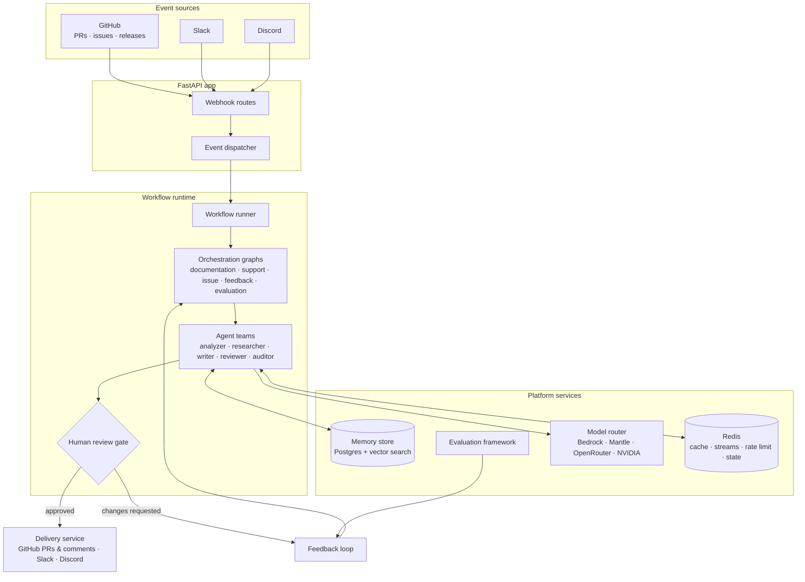

# Draftly

**Autonomous documentation engineering platform.**

Draftly is an event-driven, multi-agent backend that keeps documentation in sync with your codebase. It ingests events from GitHub, Slack, and Discord, routes them through orchestration graphs, and coordinates teams of specialized agents to analyze changes, draft updates, answer support questions, and learn from feedback — with a human review gate before anything ships.

## Features

- **GitHub change analysis** — analyzes pull requests, issues, and releases to detect documentation impact
- **Documentation generation & sync** — researches repositories and drafts conceptual docs, how-tos, tutorials, and API references from templates
- **Support agent** — triages and answers user questions in Slack and Discord, grounded in your indexed documentation
- **Feedback loop** — classifies recurring questions and gaps, prioritizes signals, and turns them into documentation improvements
- **Human-in-the-loop review** — a review gate and approval queue hold agent output until a reviewer signs off
- **Persistent memory** — vector-searchable knowledge base with curation, deduplication, and grounding checks
- **Evaluation framework** — scores outputs on groundedness, correctness, completeness, and relevance, with failure analysis for continuous improvement
- **Multi-provider model routing** — pluggable registry across Amazon Bedrock, Bedrock Mantle, OpenRouter, NVIDIA, Requesty, and Orcarouter

## Architecture



Events arrive via webhook routes under `/api/*`, are normalized by the dispatcher, and run through workflow graphs composed of specialized agents. Agent capabilities are packaged as [skills](src/draftly/skills) — self-contained rule sets for triage, research, writing, review, delivery, and memory curation. Nothing reaches users until it passes the review gate; rejected output feeds back into the knowledge base.

## Tech stack

| Layer         | Technology                                                                                         |
| ------------- | -------------------------------------------------------------------------------------------------- |
| Language      | Python 3.11, managed with [uv](https://docs.astral.sh/uv/)                                         |
| API           | FastAPI + Uvicorn                                                                                  |
| Agents        | [Strands Agents](https://github.com/strands-agents) SDK                                            |
| Database      | PostgreSQL (asyncpg / psycopg), NeonDB-compatible                                                  |
| Cache/Stream  | Redis (semantic cache, event streams, rate limiting, distributed state, API cache, dashboard push) |
| Auth          | Clerk (JWT), Slack/Discord/GitHub app auth                                                         |
| Observability | structlog, tracing, metrics, audit logging                                                         |

## Getting started

### Prerequisites

- Python 3.11+
- [uv](https://docs.astral.sh/uv/getting-started/installation/)
- A PostgreSQL database (NeonDB works out of the box)

### Install

```bash
uv sync
```

### Configure

```bash
cp .env.example .env
```

Fill in at least `DATABASE_URL` and your AWS credentials (or rely on an IAM role).

> [!TIP]
> Only `DATABASE_URL` and AWS access are required. All other model providers (NVIDIA, OpenRouter, Requesty, Orcarouter, Mantle) are optional fallbacks for the model router.

### Run

```bash
python main.py
```

This starts the FastAPI app on the configured host and port. Interactive API docs are available at `/docs`.

> [!TIP]
> Verify the server is running by visiting `http://localhost:8000/docs` in your browser. You should see the FastAPI Swagger UI with all available endpoints.

## Project structure

```
draftly-agent-backend/
├── src/draftly/
│   ├── agents/          # Agent definitions and prompts
│   ├── evaluation/      # Evaluation framework and datasets
│   ├── integrations/    # Slack, Discord, GitHub, database
│   ├── models/          # Model router and providers
│   ├── orchestration/   # Graphs, nodes, routing
│   ├── skills/          # Self-contained agent skill definitions
│   └── workflows/       # Workflow definitions
├── scripts/             # CLI scripts (evaluation runner, etc.)
├── workers/             # Background worker processes
├── config/              # Environment-specific configuration
└── simulation/          # End-to-end test scenarios
```

## Background workers

Draftly splits long-running work into dedicated worker processes:

| Worker              | Purpose                                                                                      | Command                                         |
| ------------------- | -------------------------------------------------------------------------------------------- | ----------------------------------------------- |
| `event_worker`      | Serves the API so webhook events are processed by the in-process workflow runner             | `python -m workers.event_worker`                |
| `workflow_worker`   | Runs periodic jobs: workflow retries and review expiry                                       | `python -m workers.workflow_worker`             |
| `indexing_worker`   | Pulls repository content into the documentation store and refreshes the index on an interval | `python -m workers.indexing_worker`             |
| `evaluation_worker` | Runs the evaluation loop once (batch) or continuously (`--watch`, CI mode)                   | `python -m workers.evaluation_worker [--watch]` |

Environment-specific defaults live in [`config/`](config) (`development.yaml`, `staging.yaml`, `production.yaml`).

## Configuration

Key environment variables (see [`.env.example`](.env.example) for the full list):

| Variable                                                                         | Description                                                   |
| -------------------------------------------------------------------------------- | ------------------------------------------------------------- |
| `DATABASE_URL`                                                                   | PostgreSQL connection string                                  |
| `REDIS_URL`                                                                      | Redis connection string (default: `redis://localhost:6379/0`) |
| `SEMANTIC_CACHE_ENABLED`                                                         | Enable LLM semantic cache (default: `True`)                   |
| `VECTOR_SEARCH_BACKEND`                                                          | `redis`, `pgvector`, or `dual` (default: `dual`)              |
| `EVENT_BUS_BACKEND`                                                              | `pubsub`, `stream`, or `dual` (default: `dual`)               |
| `AWS_REGION`                                                                     | Region for Amazon Bedrock                                     |
| `BEDROCK_CLAUDE_REASONING_MODEL` / `BEDROCK_CLAUDE_FAST_MODEL`                   | Claude model overrides                                        |
| `EMBEDDING_MODEL_ID`                                                             | Embedding model for semantic search                           |
| `MANTLE_API_KEY` / `MANTLE_ENDPOINT_URL`                                         | Bedrock Mantle (OpenAI-compatible) endpoint                   |
| `OPENROUTER_API_KEY`, `NVIDIA_API_KEY`, `REQUESTY_API_KEY`, `ORCAROUTER_API_KEY` | Optional additional providers                                 |

## Development

### Code quality

```bash
uv run ruff check .              # lint
uv run ruff format --check .     # format check
uv run mypy src                  # type check
```

### Testing

```bash
uv run pytest                    # unit + workflow tests
uv run pytest -m integration     # live integration tests
```

> [!IMPORTANT]
> Integration tests hit a live database and real model endpoints. Set `DRAFTLY_LIVE=1` and provide valid credentials before running them.

### Evaluation

Run live evaluation of agent outputs against golden datasets for each surface type:

```bash
# Documentation (PR event) evaluation
uv run python scripts/run_evaluation.py --live --datasets src/draftly/evaluation/datasets/documentation.json

# GitHub issue evaluation
uv run python scripts/run_evaluation.py --live --datasets src/draftly/evaluation/datasets/github_issues.json

# Support question evaluation
uv run python scripts/run_evaluation.py --live --datasets src/draftly/evaluation/datasets/support.json
```

> [!NOTE]
> Live runs invoke real agent graphs and LLM judges. Each dataset runs with a ~600s inner budget. Use `--datasets` with a single-case file for smoke runs to stay within timeouts.

**Evaluation metrics:**

| Metric | Description |
|--------|-------------|
| `groundedness` | All claims traceable to provided evidence |
| `correctness` | Factually accurate, no hallucinations |
| `completeness` | Covers all essential information |
| `relevance` | Directly addresses the user's question |
| `documentation_quality` | Citation coverage, topic coverage, adequate detail |

## Documentation

Design documents live in [`docs/`](docs), covering:

- **Architecture** — system overview & design, event-driven design, multi-agent topology, orchestration graphs, memory, feedback loop, documentation pipeline, persistence, integrations, security, delivery, evaluation, review, observability, support, tools, Redis, and the models router
- **Agents** — agent overview, subagents (Research Swarm), and the 20 packaged skills
- **API** — route reference and webhook handling for GitHub/Slack/Discord/Clerk
- **Workflows** — workflow system overview plus documentation sync, GitHub PR/issue, support, and feedback loop guides
- **Deployment** — AWS, production checklist, CockroachDB, and Redis operations

[`simulation/scenarios/`](simulation/scenarios) contains end-to-end scenarios used to exercise auth flows (OAuth, PKCE), RBAC, token rotation, API key deprecation, and SDK breaking changes against the platform.
