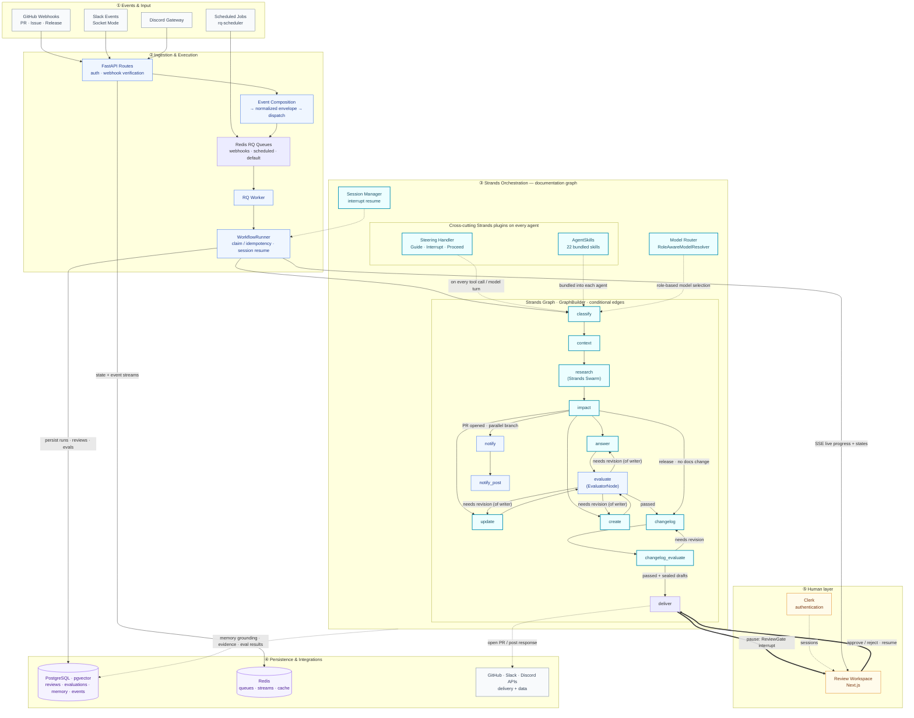

<!-- prettier-ignore -->
<div align="center">

# Draftly

**Documentation that keeps up with your code.**

[](LICENSE)
[](https://www.python.org/)
[](https://github.com/strands-agents/sdk-python)
[](https://agentsforhumans.devpost.com/)

[Walkthrough](#from-code-change-to-reviewed-documentation) · [Architecture](#architecture) · [Run locally](#run-draftly) · [Frontend](../draftly-agent-frontend/README.md)

</div>

Draftly helps SDK maintainers and developer teams keep documentation aligned with their code. It watches GitHub changes and developer questions, researches the project, and prepares documentation updates for review — so maintainers can focus on decisions instead of repeatedly investigating and rewriting docs.

Built with **Strands Agents SDK**, a Python/FastAPI backend, and a Next.js review workspace. This directory contains the backend; the [frontend](../draftly-agent-frontend/README.md) provides onboarding, workflow inspection, and human review.

<div align="center">
  
</div>

## Features

- **Event-triggered documentation maintenance** — starts from merged PRs and release events
- **Grounded developer support** — answers GitHub, Slack, and Discord questions with project context
- **Research with evidence** — connects proposed answers and updates to repository and documentation sources
- **Configurable human review** — `always`, `risky`, or `never` review policies gate delivery
- **Feedback and project memory** — curates knowledge candidates and provides curation and retrieval workflows
- **Agent observability** — inspect agent catalog, runs, and steps via authenticated API

## From code change to reviewed documentation

**Illustrative walkthrough: adding OAuth authentication to Authly.** Authly is a fictional benchmark application used to exercise documentation drift. This example follows the checked-in `oauth-authentication-add` evaluation case.

> [!NOTE]
> This walkthrough is illustrative; dataset expectations are not evidence of a successful execution. See the [evidence audit](docs/readme-evidence-audit.md) for what was verified.

1. **A change arrives.** The case represents a merged PR adding OAuth authorization URLs, authorization-code exchange, and OAuth-backed login. The production GitHub route skips PR events that are not merged.
2. **Draftly researches the impact.** Agents inspect the repository and documentation, including the OAuth implementation, authentication flow, and client configuration.
3. **A documentation update is proposed.** The expected update explains provider setup, URL construction, callback handling, code exchange, and login. Writers produce a structured file-change plan; delivery tools are excluded from their tool set.
4. **The output is checked.** The documentation graph evaluates the output and can route it back for revision. It also authors and checks a changelog before reaching delivery.
5. **A maintainer decides.** With `review_policy: always`, the graph pauses before delivery. The reviewer can approve or reject; a rejection cancels delivery.
6. **Delivery follows approval.** The delivery agent has tools to create the documentation PR.

| Before                                     | Expected documentation coverage                           |
| ------------------------------------------ | --------------------------------------------------------- |
| OAuth behavior introduced without guidance | Authorization URL construction and provider configuration |
| Callback handling undocumented             | Callback handling and authorization-code exchange steps   |
| Developers lack guidance for new login     | OAuth-backed login usage                                  |

Inspect the [case and evidence references](src/draftly/evaluation/datasets/documentation.json), [GitHub event handling](src/draftly/app/api/routes/github.py), and [documentation graph](src/draftly/orchestration/graphs/documentation_graph.py).

## Agent observability API

The authenticated `/api/agents` endpoints expose the backend agent catalog and organization-scoped run telemetry:

- `GET /api/agents` — catalog entries and aggregate status/metrics, including agents with no runs.
- `GET /api/agents/{agent_id}` — safe metadata, tools, metrics, and recent runs.
- `GET /api/agents/{agent_id}/runs` — bounded, cursor-paginated runs.
- `GET /api/runs/{run_id}/steps` — persisted steps with `agent_id`, `node_id`, and `surface` where available.

> [!NOTE]
> Agent definitions remain code-defined next to the factory registry. This surface does not expose model credentials, private prompts, or raw tool arguments. Selected-run live activity continues through the existing single-use stream ticket and Redis/SSE endpoints.

## Built with Strands Agents

Strands supplies agents, graph orchestration, and interrupt hooks. Draftly supplies the domain tools, routing conditions, review policy, persistence, and delivery integration.

| Responsibility                | Implementation                                                                                                       | Why it matters                                                                                   |
| ----------------------------- | -------------------------------------------------------------------------------------------------------------------- | ------------------------------------------------------------------------------------------------ |
| Research project evidence     | [Shared researchers](src/draftly/agents/shared/research.py)                                                          | Strands agents receive tools and source-specific research instructions                           |
| Coordinate documentation work | [Documentation graph](src/draftly/orchestration/graphs/documentation_graph.py)                                       | `GraphBuilder` connects research, impact analysis, writing, evaluation, and conditional revision |
| Check outputs                 | [Runtime evaluator](src/draftly/orchestration/nodes/evaluate.py) and [evaluation framework](src/draftly/evaluation/) | Runtime quality checks and dataset-based evaluation serve different purposes                     |
| Pause for a person            | [Review gate](src/draftly/orchestration/hooks/review_gate.py)                                                        | A Strands `BeforeNodeCallEvent` interrupt prevents delivery until the required decision          |
| Deliver the result            | [Delivery agent](src/draftly/agents/shared/delivery.py)                                                              | A separate agent receives publication tools after the graph's review boundary                    |

The graph supports `always`, `risky`, and `never` review policies. Unknown policy values resolve to `always`. Review approval does not merge the resulting GitHub PR; maintainers still control that repository action.

## Architecture

The diagram summarizes the documentation path. Other surfaces have their own graphs; evaluation and review behavior depend on the selected workflow and policy.



With the default RQ configuration, long-running jobs are consumed by a separate worker. The API exposes workflow state and event streams so the frontend can display progress without holding a generation request open.

The no-documentation-change release branch goes straight from impact analysis to changelog authoring and evaluation. Review can be bypassed by policy; the graph does not promise human approval on every configuration.

For deeper implementation detail, see [orchestration](docs/architecture/orchestration.md), [model routing](docs/architecture/models-router.md), [memory](docs/architecture/memory.md), and [delivery](docs/architecture/delivery.md).

## Run Draftly

### Prerequisites

> [!IMPORTANT]
> You need Python 3.11+, `uv`, Docker for Redis, and a PostgreSQL database with the `vector` extension. Node.js and Clerk configuration are required for the frontend experience.

### 1. Install

From the workspace containing both app directories:

```bash
cd draftly-agent-backend
uv sync
cp .env.example .env
```

Configure `.env` using the table below. The example file does not list every integration setting; [Settings](src/draftly/app/config.py) is the source for those names.

| Setting                                                           | Required for                                                                                            |
| ----------------------------------------------------------------- | ------------------------------------------------------------------------------------------------------- |
| `DATABASE_URL`                                                    | Database connectivity and migrations; use a dedicated development database                              |
| `AWS_REGION` plus AWS credentials or an IAM role                  | The Bedrock model path; alternatively configure a supported model provider                              |
| `REQUESTY_API_KEY`, `ORCAROUTER_API_KEY`, or `OPENROUTER_API_KEY` | At least one embedding provider for semantic retrieval; Bedrock embeddings are not implemented directly |
| `EMBEDDING_MODEL_ID=text-embedding-3-small`                       | The configured embedding provider must serve the model and return 1,536-dimensional vectors             |
| `REDIS_URL=redis://localhost:6379/0`                              | Queue consumption, state, and event streaming                                                           |
| `DEBUG=false`                                                     | Boolean debug setting; an exported shell value overrides `.env`                                         |
| `RQ_ENABLED=true`                                                 | The recommended separate-worker execution path                                                          |
| `VECTOR_SEARCH_BACKEND=pgvector`                                  | Vector search for this setup, because Compose uses plain Redis                                          |
| `SEMANTIC_CACHE_ENABLED=false`                                    | Avoids requiring RediSearch for the semantic cache in this setup                                        |

> [!TIP]
> If your shell exports a non-boolean `DEBUG` value, run `export DEBUG=false` before starting the commands below.

### 2. Initialize the database and start Redis

```bash
uv run python scripts/bootstrap.py
docker compose -f docker-compose.redis.yml up -d redis
docker compose -f docker-compose.redis.yml exec redis redis-cli ping
```

The Redis check should return `PONG`. The bootstrap script applies SQL migrations in filename order and checks connectivity. It handles some duplicate-object errors by skipping; it is not a version-tracking migration system.

### 3. Start both native processes

In one terminal:

```bash
uv run python -m workers.rq_worker
```

In a second terminal:

```bash
uv run python main.py
```

Both processes load the same `.env`. The RQ worker consumes the `scheduled`, `webhooks`, and `default` queues under the configured prefix. Starting only the API does not consume queued jobs.

### 4. Check liveness

```bash
curl --fail http://localhost:8000/api/health
```

Expected: `{"status":"ok","service":"draftly"}`. Explore the API at [localhost:8000/docs](http://localhost:8000/docs).

### 5. Connect the review workspace

Follow the [frontend setup guide](../draftly-agent-frontend/README.md), using `API_URL=http://localhost:8000`. Configure `CLERK_PUBLISHABLE_KEY` and `CLERK_SECRET_KEY` on the backend for the same Clerk application used by the frontend.

For the GitHub workflow, configure `GITHUB_APP_ID`, `GITHUB_APP_SLUG`, `GITHUB_PRIVATE_KEY_PATH`, and `GITHUB_WEBHOOK_SECRET`. Install the GitHub App on the target repository and configure its webhook against your backend. See [webhooks](docs/api/webhooks.md) and [GitHub workflow behavior](docs/workflows/github-pr.md).

> [!NOTE]
> Slack and Discord credentials are needed only when connecting those integrations. See [integration architecture](docs/architecture/integrations.md).

## Development and documentation

```bash
uv run ruff check .
uv run ruff format --check .
uv run mypy src
uv run pytest -m "not integration"
```

> [!NOTE]
> Live integration tests use external services. Set `DRAFTLY_LIVE=1` before running `uv run pytest -m integration`. These commands are developer entry points, not a claim that this documentation change ran the application test suite.

| Area                        | Entry point                                                                           |
| --------------------------- | ------------------------------------------------------------------------------------- |
| Agents, prompts, and skills | [Agents](src/draftly/agents/) · [packaged skills](src/draftly/skills/)                |
| Graphs and execution        | [Orchestration](src/draftly/orchestration/) · [workflows](src/draftly/workflows/)     |
| API and integrations        | [API routes](src/draftly/app/api/routes/) · [integrations](src/draftly/integrations/) |
| Quality and retrieval       | [Evaluation](src/draftly/evaluation/) · [memory](src/draftly/memory/)                 |
| Frontend                    | [Next.js workspace](../draftly-agent-frontend/README.md)                              |

Continue with the [architecture overview](docs/architecture/overview.md), [workflow guides](docs/workflows/overview.md), [API reference](docs/api/routes.md), [Redis operations](docs/deployment/redis.md), and [production deployment](docs/deployment/production.md).

## Resources

- [Strands Agents SDK](https://github.com/strands-agents/sdk-python)
- [Architecture overview](docs/architecture/overview.md)
- [Workflow guides](docs/workflows/overview.md)
- [API reference](docs/api/routes.md)
- [Production deployment](docs/deployment/production.md)
- [Agents for Humans hackathon](https://agentsforhumans.devpost.com/)

<details>
<summary><h3>Deploy to Amazon Bedrock AgentCore Runtime</h3></summary>

Draftly ships a standalone AgentCore Runtime entrypoint (`agentcore_server.py`, port 8080) that drives the composed Strands workflows. It exposes the two mandatory endpoints:

- `GET /ping` — liveness probe.
- `POST /invocations` — body `{"input": {"event": {...}}}` where `event` is a normalized Draftly workflow event (must include a routable `event_type`). The run id defaults from the `x-agentcore-session-id` header (33+ chars) when `event.event_id` is absent. Returns `{"output": <run state>}`.

Deploy steps:

```bash
make docker-build-agentcore        # linux/arm64 8080 image
make docker-push-agentcore         # push to ECR (draftly-agentcore)
cd infra/aws/terraform && terraform apply
```

The Terraform module provisions the ECR repo, AgentCore runtime IAM role, CloudWatch log group, and invokes `scripts/deploy_agentcore.py` to create the agent runtime with OTel env wired into the container (`OTEL_SERVICE_NAME`, `OTEL_EXPORTER_OTLP_ENDPOINT`). CloudWatch transaction search is a one-time per-account enable step in the CloudWatch console (Application Signals > Transaction search); for full ADOT auto-instrumentation run the container with `opentelemetry-instrument python agentcore_server.py` and the `aws-opentelemetry-distro` package.

Invoke a deployed runtime:

```python
import boto3, json

client = boto3.client("bedrock-agentcore", region_name="us-east-1")
response = client.invoke_agent_runtime(
    agentRuntimeArn="arn:aws:bedrock-agentcore:us-east-1:<account>:runtime/draftly-agentcore-suffix",
    runtimeSessionId="a" * 33,  # 33+ characters
    payload=json.dumps({"input": {"event": {"event_type": "slack_support"}}}).encode(),
)
print(json.loads(response["response"].read()))
```

</details>

<details>
<summary><h3>Rebuild and restart Redis and worker containers</h3></summary>

The Redis container is a stateless dev dependency pulled from `redis:7-alpine`; the `rq-worker` container is built from [docker/Dockerfile.worker](docker/Dockerfile.worker) and must be rebuilt to pick up source changes. All compose commands run from `draftly-agent-backend/` and require the `-f docker-compose.redis.yml` flag.

Rebuild the worker image and recreate both containers (the typical command after code changes):

```bash
docker compose -f docker-compose.redis.yml up -d --build
```

| Goal                                        | Command                                                              |
| ------------------------------------------- | -------------------------------------------------------------------- |
| Rebuild just the worker image (no recreate) | `docker compose -f docker-compose.redis.yml build rq-worker`         |
| Recreate the worker from the rebuilt image  | `docker compose -f docker-compose.redis.yml up -d rq-worker`         |
| Restart the worker without rebuilding       | `docker compose -f docker-compose.redis.yml restart rq-worker`       |
| Force recreate even if nothing is stale     | `docker compose -f docker-compose.redis.yml up -d --force-recreate`  |
| Start or restart Redis only                 | `docker compose -f docker-compose.redis.yml up -d redis`             |
| Follow logs for both containers             | `docker compose -f docker-compose.redis.yml logs -f rq-worker redis` |
| Stop both containers                        | `docker compose -f docker-compose.redis.yml down`                    |

> [!WARNING]
> `--build` is required to pick up code changes; `restart` alone reuses the old image. The worker loads `.env` and needs `secrets/private-key.pem` at build time. Recreating Redis drops queued-but-unprocessed jobs, so drain the queues or expect to re-dispatch.

</details>
