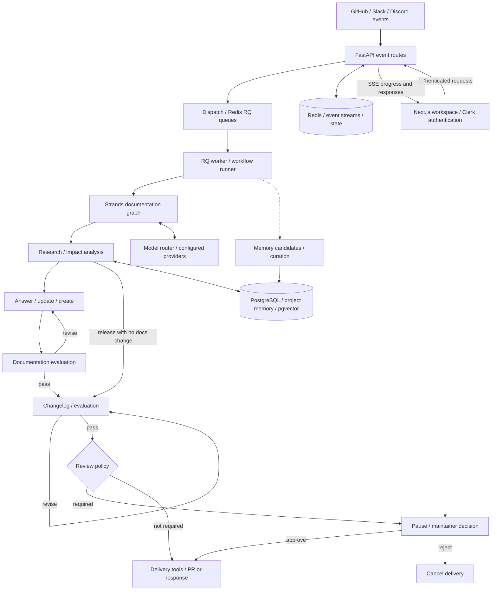

# Draftly

**Documentation that keeps up with your code.**

Draftly helps SDK maintainers and developer teams keep documentation aligned with their code. It watches GitHub changes and developer questions, researches the project, and prepares documentation updates for review, so maintainers can focus on decisions instead of repeatedly investigating and rewriting docs.

Built with **Strands Agents SDK**, a Python/FastAPI backend, and a Next.js review workspace. This directory contains the backend; the [frontend](../draftly-agent-frontend/README.md) provides onboarding, workflow inspection, and human review.

[Walkthrough](#from-code-change-to-reviewed-documentation) · [Strands implementation](#built-with-strands-agents) · [Architecture](#architecture) · [Evaluation](#evaluation-and-evidence) · [Run locally](#run-draftly) · [Frontend](../draftly-agent-frontend/README.md)

## See Draftly in action

Start with the [OAuth documentation walkthrough](#from-code-change-to-reviewed-documentation): a code change creates a documentation gap, agents prepare an update, and a maintainer decides whether to deliver it.

The [documentation dataset](src/draftly/evaluation/datasets/documentation.json) exposes the scenario, expected research tools, and required review interruption. The [frontend guide](../draftly-agent-frontend/README.md) describes the workspace for inspecting the result.

A recorded demonstration and verified generated PR are not included here yet. The walkthrough below is illustrative; dataset expectations are not evidence of a successful execution. See the [evidence audit](docs/readme-evidence-audit.md) for what was verified.

## Who it helps

For SDK maintainers and developer teams, shipping an API change starts another job: identify affected guides, research the new behavior, update examples, and answer questions from people following older instructions. Draftly connects those tasks to the changes and conversations that caused them.

The intended outcome is a reviewable documentation change with supporting project context. Maintainers retain the publication decision when their review policy requires it.

## From code change to reviewed documentation

**Illustrative walkthrough: adding OAuth authentication to Authly.** Authly is a fictional benchmark application used to exercise documentation drift. This example follows the checked-in `oauth-authentication-add` evaluation case; it is not a report of a completed run.

1. **A change arrives.** The case represents a merged PR adding OAuth authorization URLs, authorization-code exchange, and OAuth-backed login. The production GitHub route skips PR events that are not merged.
2. **Draftly researches the impact.** Agents inspect the repository and documentation, including the OAuth implementation, authentication flow, and client configuration. The dataset lists evidence references and expects repository tools to be used.
3. **A documentation update is proposed.** The expected update explains provider setup, URL construction, callback handling, code exchange, and login. Writers produce a structured file-change plan; delivery tools are excluded from their tool set.
4. **The output is checked.** The documentation graph evaluates the output and can route it back for revision. It also authors and checks a changelog before reaching delivery.
5. **A maintainer decides.** With `review_policy: always`, the graph pauses before delivery. The reviewer can approve or reject; a rejection cancels delivery. The dataset explicitly expects this interruption.
6. **Delivery follows approval.** The delivery agent has tools to create the documentation PR. A completed run would need an actual PR and delivery receipt to demonstrate this final step.

The proposed change turns missing OAuth guidance into a reviewable update:

| Before, as described by the case | Expected documentation coverage |
| --- | --- |
| OAuth behavior is introduced without complete guidance | Authorization URL construction and provider configuration |
| Callback handling and code exchange are undocumented | Callback handling and authorization-code exchange steps |
| Developers lack guidance for the new login flow | OAuth-backed login usage |

Inspect the [case and its evidence references](src/draftly/evaluation/datasets/documentation.json), [GitHub event handling](src/draftly/app/api/routes/github.py), and [documentation graph](src/draftly/orchestration/graphs/documentation_graph.py).

## Core capabilities

| Capability | What it does for the maintainer |
| --- | --- |
| Event-triggered documentation maintenance | Starts documentation work from merged PRs and release events |
| Grounded developer support | Uses project context to answer GitHub, Slack, and Discord questions |
| Research with evidence | Connects proposed answers and updates to repository and documentation sources |
| Configurable human review | Holds delivery for approval under `always`, or for classified risks under `risky`; `never` bypasses the gate |
| Feedback and project memory | Collects knowledge candidates and provides curation and retrieval workflows for later work |

Memory curation can create, merge, supersede, or archive knowledge when its workflow runs. Model routing can use stored task-performance statistics. Changes to prompts and packaged skills remain developer work; this README does not claim they rewrite themselves or that every run improves future quality.

## Built with Strands Agents

Strands supplies agents, graph orchestration, and interrupt hooks. Draftly supplies the domain tools, routing conditions, review policy, persistence, and delivery integration.

| Responsibility | Implementation | Why it matters |
| --- | --- | --- |
| Research project evidence | [Shared researchers](src/draftly/agents/shared/research.py) | Strands agents receive tools and source-specific research instructions |
| Coordinate documentation work | [Documentation graph](src/draftly/orchestration/graphs/documentation_graph.py) | `GraphBuilder` connects research, impact analysis, writing, evaluation, and conditional revision |
| Check outputs | [Runtime evaluator](src/draftly/orchestration/nodes/evaluate.py) and [evaluation framework](src/draftly/evaluation/) | Runtime quality checks and dataset-based evaluation serve different purposes |
| Pause for a person | [Review gate](src/draftly/orchestration/hooks/review_gate.py) | A Strands `BeforeNodeCallEvent` interrupt prevents delivery until the required decision |
| Deliver the result | [Delivery agent](src/draftly/agents/shared/delivery.py) | A separate agent receives publication tools after the graph's review boundary |

Research and writing need to interpret changing code and incomplete context. Explicit graph conditions and review policy constrain when their output can proceed. The writer's tool restrictions keep authoring separate from repository mutation.

The graph supports `always`, `risky`, and `never` review policies. Unknown policy values resolve to `always`. Review approval does not merge the resulting GitHub PR; maintainers still control that repository action.

## Architecture

The diagram summarizes the documentation path. Other surfaces have their own graphs; evaluation and review behavior depend on the selected workflow and policy.



With the default RQ configuration, long-running jobs are consumed by a separate worker. The API exposes workflow state and event streams so the frontend can display progress without holding a generation request open.

The no-documentation-change release branch goes straight from impact analysis to changelog authoring and evaluation. Review can be bypassed by policy; the graph does not promise human approval on every configuration.

For deeper implementation detail, see [orchestration](docs/architecture/orchestration.md), [model routing](docs/architecture/models-router.md), [memory](docs/architecture/memory.md), and [delivery](docs/architecture/delivery.md).

## Evaluation and evidence

**This README does not yet publish measured benchmark results.** The repository contains evaluation scenarios and evaluation code, but the evidence audit found no qualifying saved run report with reproducible results to cite. No success rate, time saving, or cost claim is made.

The [datasets](src/draftly/evaluation/datasets/) cover these workflow surfaces:

| Dataset | Intended coverage |
| --- | --- |
| `documentation.json` | OAuth documentation updates from a merged PR |
| `github_issues.json` | GitHub issue handling |
| `slack.json` / `discord.json` | Support questions from different event sources |
| `feedback.json` | Documentation gaps and prioritization |
| `release.json` | Release authoring and review behavior |

The framework distinguishes **LLM-judged quality**—groundedness, correctness, completeness, and relevance—from **deterministic checks**, including expected interruption and passthrough. Documentation quality also uses citation, coverage, and length heuristics. A score is evidence about the tested cases, not a correctness guarantee.

After configuring the runtime and adapting dataset paths and project identifiers to your checkout, run one live dataset from this directory:

```bash
uv run python scripts/run_evaluation.py --live --datasets src/draftly/evaluation/datasets/documentation.json
```

Use `github_issues.json`, `slack.json`, `discord.json`, `feedback.json`, or `release.json` in the same command to select another surface. Live runs invoke real agents and LLM judges and can incur provider costs; they also start the configured application and require its services. Inspect the printed workflow status, errors, and results, not just the process exit code.

The checked-in cases include machine-specific `repo_dir` values and project/organization identifiers. They require adaptation before reproduction on another machine. The sample documentation case expects a review interruption, so passing it alone would not establish successful publication.

For any published run, record the commit, dataset, model, date, case count, repeated-run count, completion results, review checks, and measured runtime/cost. Authly is a fictional evaluation project; its results alone do not establish performance across arbitrary repositories. See [evaluation internals](docs/architecture/evaluation.md) and the [evidence audit](docs/readme-evidence-audit.md).

## Run Draftly

This is the recommended **native API + native RQ worker + containerized Redis** development topology, derived from the current source. A fresh database setup and integrated delivery were not executed during this documentation review.

### 1. Install

You need Python 3.11+, `uv`, Docker for Redis, and a PostgreSQL database supporting the `vector` extension. Node.js and Clerk configuration are additionally required for the frontend experience.

From the workspace containing both app directories:

```bash
cd draftly-agent-backend
uv sync
cp .env.example .env
```

Configure `.env` using the table below. The example file does not list every integration setting; [Settings](src/draftly/app/config.py) is the source for those names.

| Setting | Required for |
| --- | --- |
| `DATABASE_URL` | Database connectivity and migrations; use a dedicated development database |
| `AWS_REGION` plus AWS credentials or an IAM role | The Bedrock model path; alternatively configure a supported model provider |
| `REQUESTY_API_KEY`, `ORCAROUTER_API_KEY`, or `OPENROUTER_API_KEY` | At least one embedding provider for semantic retrieval; Bedrock embeddings are not implemented directly |
| `EMBEDDING_MODEL_ID=text-embedding-3-small` | The configured embedding provider must serve the model and return 1,536-dimensional vectors |
| `REDIS_URL=redis://localhost:6379/0` | Queue consumption, state, and event streaming |
| `DEBUG=false` | Boolean debug setting; an exported shell value overrides `.env` |
| `RQ_ENABLED=true` | The recommended separate-worker execution path |
| `VECTOR_SEARCH_BACKEND=pgvector` | Vector search for this setup, because Compose uses plain Redis |
| `SEMANTIC_CACHE_ENABLED=false` | Avoids requiring RediSearch for the semantic cache in this setup |

An embedding provider credential must have access to the configured model; its presence alone does not prove compatibility. Provider registration and defaults are defined in the [model factory](src/draftly/models/factory.py).

If your shell exports a non-boolean `DEBUG` value, set `export DEBUG=false` before running the commands below. This also applies to CLI help because the evaluation script imports application settings before parsing arguments.

### 2. Initialize the database and start Redis

The bootstrap script applies SQL migrations in filename order and checks database connectivity. Run it against your development database and inspect its output:

```bash
uv run python scripts/bootstrap.py
docker compose -f docker-compose.redis.yml up -d redis
docker compose -f docker-compose.redis.yml exec redis redis-cli ping
```

The Redis check should return `PONG`. The database account needs permission to apply the migrations, including creation of the `vector` extension. The bootstrap script handles some duplicate-object errors by skipping; it is not a version-tracking migration system.

### 3. Start both native processes

In one terminal, from `draftly-agent-backend/`:

```bash
uv run python -m workers.rq_worker
```

In a second terminal, from the same directory:

```bash
uv run python main.py
```

Both processes load the same `.env`. The RQ worker consumes the `scheduled`, `webhooks`, and `default` queues under the configured prefix. Starting only the API does not consume queued jobs.

### 4. Check liveness

```bash
curl --fail http://localhost:8000/api/health
```

Expected response: `{"status":"ok","service":"draftly"}`. This endpoint checks API liveness, not model access or successful agent execution. Explore the API at [localhost:8000/docs](http://localhost:8000/docs).

### 5. Connect the review workspace

Follow the [frontend setup guide](../draftly-agent-frontend/README.md), using `API_URL=http://localhost:8000`. Configure `CLERK_PUBLISHABLE_KEY` and `CLERK_SECRET_KEY` on the backend for the same Clerk application used by the frontend; `CLERK_SIGNING_SECRET` is needed for Clerk webhook verification.

For the GitHub workflow, configure `GITHUB_APP_ID`, `GITHUB_APP_SLUG`, `GITHUB_PRIVATE_KEY_PATH`, and `GITHUB_WEBHOOK_SECRET`. Install the GitHub App on the target repository and configure its webhook against your reachable backend. Use onboarding to select the repository and documentation source. See [webhooks](docs/api/webhooks.md) and [GitHub workflow behavior](docs/workflows/github-pr.md).

After connecting the repository, a merged PR is the documentation trigger. The intended observable sequence is a workflow run, a review item when required, and a delivery artifact after approval. This complete integrated sequence remains unverified in this README; use the [illustrative scenario](#from-code-change-to-reviewed-documentation) to understand the expected behavior.

Slack and Discord credentials are needed only when connecting those integrations. See [integration architecture](docs/architecture/integrations.md).

For alternate Redis and worker containers, see [Redis deployment](docs/deployment/redis.md). The [production guide](docs/deployment/production.md) records the current API-container packaging limitation.

## Current limitations

- **Evidence:** no recorded demonstration or qualifying measured benchmark report is linked here yet.
- **Portability:** evaluation datasets contain local paths and project identifiers that need adaptation.
- **Setup:** the documented development path has been inspected against source, but fresh migrations and integrated delivery have not been run for this review.
- **Containers:** the current API Dockerfile runs `main.py` without copying it into the runtime image; native API startup is the documented path.
- **License:** the checked-in `LICENSE` file is empty; a license has not been established by that file.

## Development and documentation

From this directory:

```bash
uv run ruff check .
uv run ruff format --check .
uv run mypy src
uv run pytest -m "not integration"
```

Live integration tests use external services. Configure their credentials and set `DRAFTLY_LIVE=1` before running `uv run pytest -m integration`. These commands are developer entry points, not a claim that this documentation change ran the application test suite.

| Area | Entry point |
| --- | --- |
| Agents, prompts, and skills | [Agents](src/draftly/agents/) · [packaged skills](src/draftly/skills/) |
| Graphs and execution | [Orchestration](src/draftly/orchestration/) · [workflows](src/draftly/workflows/) |
| API and integrations | [API routes](src/draftly/app/api/routes/) · [integrations](src/draftly/integrations/) |
| Quality and retrieval | [Evaluation](src/draftly/evaluation/) · [memory](src/draftly/memory/) |
| Frontend | [Next.js workspace](../draftly-agent-frontend/README.md) |

Continue with the [architecture overview](docs/architecture/overview.md), [workflow guides](docs/workflows/overview.md), [API reference](docs/api/routes.md), [Redis operations](docs/deployment/redis.md), and [production deployment](docs/deployment/production.md).

## Hackathon and license

Draftly is being developed for the [Agents for Humans hackathon](https://agentsforhumans.devpost.com/), with **Professional Agents** as its intended track. Its contribution is documentation maintenance that runs from project events and brings a person in at the configured review boundary.

The competition asks for a public repository, setup instructions, an architecture diagram, and a demonstration video of up to five minutes. It also requires an MIT or Apache open-source license. The current [LICENSE](LICENSE) is empty, so this README does not claim that licensing requirement is satisfied. The project owner must choose and add the license before submission.
